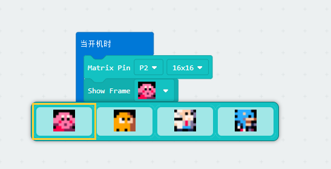
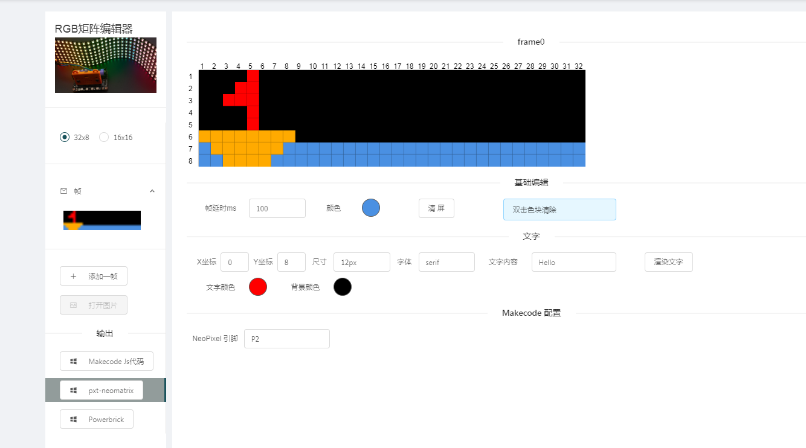
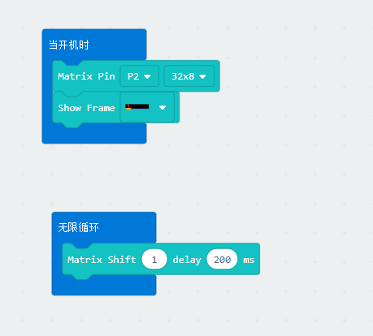
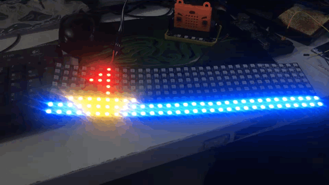

# Neo Matrix for makecode

An easy way to show anmations or images on neopixel matrix panel.



## How to use

### Important: You have to enable 'editor extension ' from experiment tab (setting->about->experiment)


click the 'NeoMatrix editor" in then extension flyout

It may take some while to load the extension code from github,I confirmed myself it will work with latest beta editor

Load this extension to makecode editor and select **NeoMatrix Editor**, it will navigate to our website paint editor.  



After finished editing the animation frames, please press **pxt-neomatrix** in the bottom left. You may find a newly added block **show frame** in makecode.



Check the final effect



----------

## License

MIT

## Supported targets

* for PXT/microbit
(The metadata above is needed for package search.)

```package
neomatrix=github:Kittenbot/pxt-neomatrix
```
